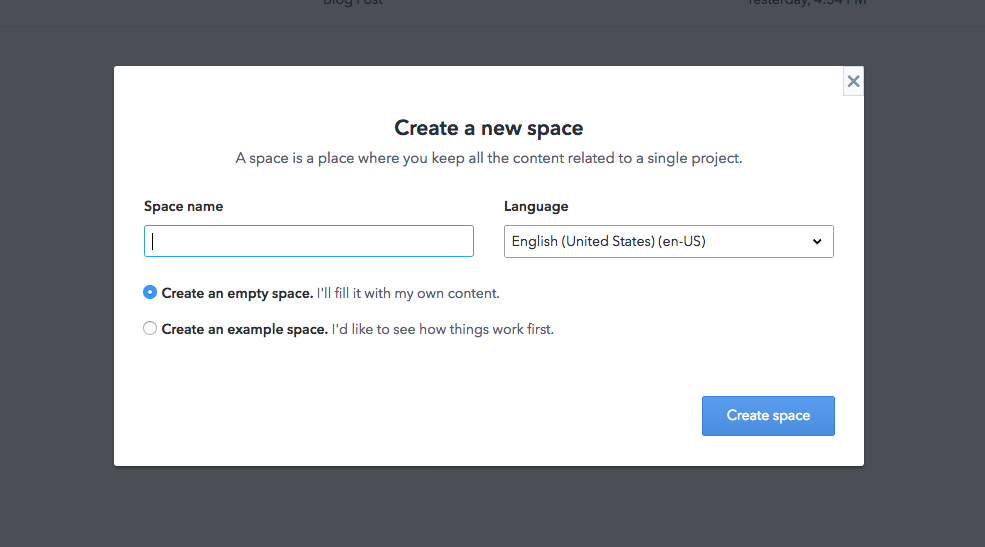
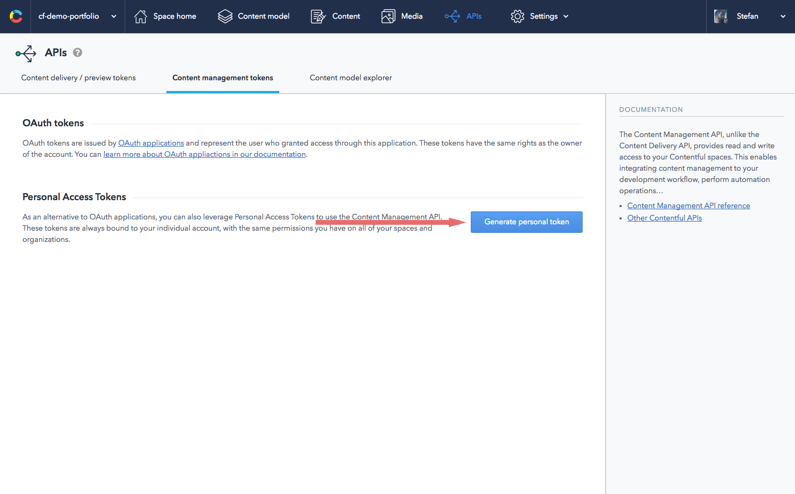
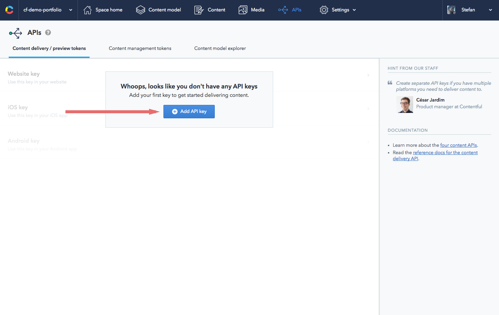
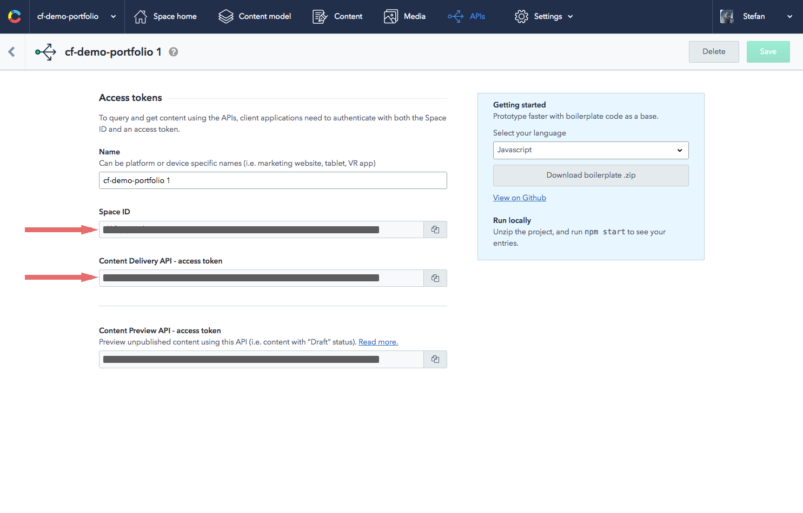

# You don't have to set this up yourself

The following steps describe what is needed to set this project up manually. **You can also follow our [Interactive getting started CLI tutorial](https://www.contentful.com/developers/docs/tutorials/general/get-started/) to save some time.** ;)

## Getting started

To get you started you have to be registered at [Contentful](https://www.contentful.com).

### Clone the repo and install dependencies

```bash
$ git clone git@github.com:contentful/blog-in-5-minutes.git
$ cd blog-in-5-minutes
$ npm install
```

### Get needed config data from Contentful

To set up and use a new space you have to create and retrieve the needed access tokens. So let's jump right into it...

#### Create a new space

You can create a new space by pressing in the space overview in the top left corner of the web app.



#### Create a Content Management API token

To create a new Content Management API token navigate to `APIs` in the top level menu and then to `Content Managements Tokens`.



*You'll need Content Management API token to write the provided data into your space.*

#### Create a Content Delivery API token and get space ID

To create a new Content Management API token navigate to `APIs` in the top level menu and then to `Content Delivery / Preview tokens`.




*You'll need the Content Delivery API token to access the data stored in your space.*

### Import data in your newly created space

To import the content model and data you can use a tool from the Contentful ecosystem - [contentful-import](https://www.npmjs.com/package/contentful-import). This tool allows you to set up a new space with before exported data. It requires at least a Content Management API token and the id of the space that should be filled with data.

To make it not necessary to install contentful-import globally it's defined as a development dependency which means that you can use it via an npm scripts command. Run `npm run import-data` with the additional parameters.

*Side note: `--` is needed hand npm scripts arguments over to the actual command*

```bash
$ npm run import-data -- --space-id YOUR_SPACE_ID --management-token YOUR_MANAGEMENT_TOKEN
```

### Create a config file

Now that you have the Contentful setup done, it's time to define the configuration to run the project. To make this project work locally you have to rename the `.contentful.sample.json` in the root of the directory to `.contentful.json`. You have to set two values:

Needed config data:
- the ID of the space where your data lives - `CTF_SPACE_ID`
- the Content Delivery API token so that you can fetch the data - `CTF_CDA_ACCESS_TOKEN`
- the Content Management API token so that you can fetch the valid tags - `CTF_CMA_ACCESS_TOKEN`

```javascript
{
  // these values are already correct
  "CTF_PERSON_ID": "15jwOBqpxqSAOy2eOO4S0m",
  "CTF_BLOG_POST_TYPE_ID": "blogPost",
  "CTF_CAROUSEL_TYPE_ID": "carouselMenu",

  // these values have to be defined by you
  "CTF_SPACE_ID": "YOUR_SPACE_ID",
  "CTF_CDA_ACCESS_TOKEN": "YOUR_DELIVERY_ACCESS_TOKEN",
  "CTF_CMA_ACCESS_TOKEN": "YOUR_MANAGEMENT_ACCESS_TOKEN"
};
```
**Remember:** Comments are not allowed in JSON so make sure to remove them. ;)

### Preview your the site

To see the site working with your newly created data all you have to do is to run `npm run dev`. This command starts a server at `localhost:3000`.

### Deploy the site to `now`

`now` is a fairly new service by [zeit](https://zeit.co), which also provides static hosting. If you run `npm run deploy` you're asked for your email adress (which you have to confirm) once and then your site will find its way into the cloud.

```bash
$ npm run deploy
```
